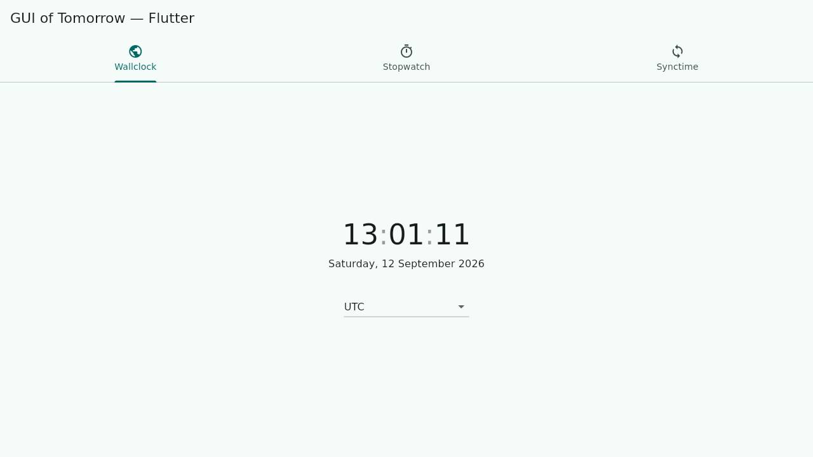
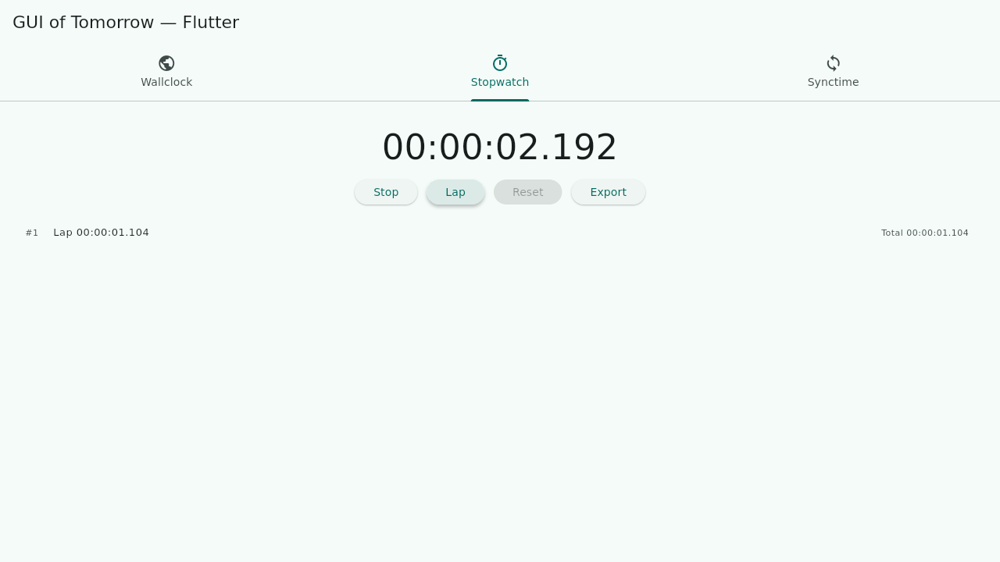
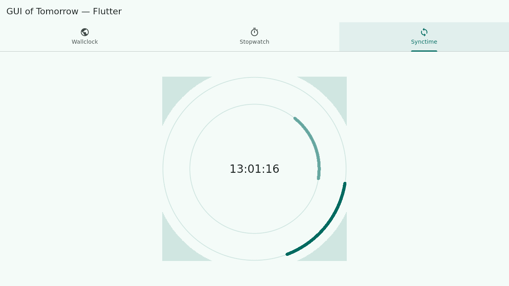
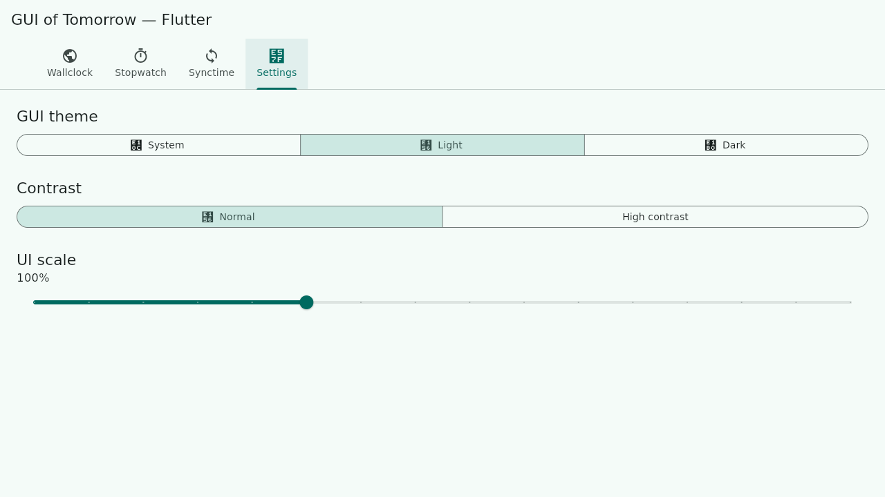

# Flutter clock demonstrator

The Flutter contester for the [GUI of Tomorrow](../README.md) comparison: a
tabbed clock app (wallclock, stopwatch, synctime, settings) built with
[Flutter](https://flutter.dev)/Dart. See [../OVERVIEW.md](../OVERVIEW.md#flutter-dart)
for the framework write-up and [IMPLEMENTATION.md](IMPLEMENTATION.md) for the
completeness checklist.

## Installing the development environment

1. Install the Flutter SDK (this project was built and tested against
   **Flutter 3.47.4 / Dart 3.13.3**, stable channel):
   - Download the SDK archive for your OS from
     https://docs.flutter.dev/get-started/install and extract it, or use a
     version manager (`fvm`), or your OS package manager.
   - Add `<flutter-sdk>/bin` to your `PATH`.
2. Run `flutter doctor` and follow its instructions to install any missing
   platform tooling. For this project you need at least one of:
   - **Linux desktop**: a C/C++ toolchain (clang, cmake, ninja, pkg-config)
     and GTK 3 development headers — on Debian/Ubuntu:
     `sudo apt install clang cmake ninja-build pkg-config libgtk-3-dev`
   - **Windows desktop**: Visual Studio 2022 with the "Desktop development
     with C++" workload.
   - **Android**: Android Studio (or just the command-line SDK tools) with
     a platform + build-tools installed, and either a device with USB
     debugging enabled or an emulator.
3. From this directory, fetch dependencies:
   ```sh
   flutter pub get
   ```

## Building, running and debugging

Run on a connected device or desktop (pick whichever `flutter devices`
lists):

```sh
flutter run -d linux      # Linux desktop
flutter run -d windows    # Windows desktop
flutter run -d <device>   # a connected/emulated Android device
```

`flutter run` supports hot reload (`r`) and hot restart (`R`) from the
terminal. For interactive debugging (breakpoints, variable inspection), open
this folder in VS Code (Dart/Flutter extensions) or Android Studio/IntelliJ
(Flutter plugin) and use their built-in "Run"/"Debug" actions, or attach
DevTools to a running `flutter run` session (it prints a DevTools URL on
startup).

Static analysis and the test suite:

```sh
flutter analyze
flutter test
```

## Creating the deliverable application package

```sh
flutter build linux --release     # -> build/linux/x64/release/bundle/
flutter build windows --release   # -> build/windows/x64/runner/Release/
flutter build apk --release       # -> build/app/outputs/flutter-apk/app-release.apk
flutter build appbundle --release # Play Store bundle, if publishing there
```

The Linux and Windows builds produce a self-contained folder (executable +
`data/` + bundled shared libraries) that can be zipped and distributed as-is;
there is no separate installer step for this demonstrator.

## What it demonstrates

- **Wallclock** — current date/time in a user-selectable IANA timezone,
  persisted across restarts (`shared_preferences`), rendered with the
  `timezone`/`intl` packages; the `:` separators blink once a second as a
  small clock-face animation (`AnimatedOpacity`).
- **Stopwatch** — start/stop/reset/lap using `dart:core`'s `Stopwatch`,
  with recorded laps exportable as a plain-text report
  (`path_provider` + `dart:io`).
- **Synctime** — a `CustomPainter` drawing two arcs (1 rotation/second and
  1 rotation/minute) around a live `hh:mm:ss` readout, redrawn ~30 times a
  second via a periodic `Timer`.
- **Settings** — GUI theme (system/light/dark via `MaterialApp.themeMode`),
  contrast (normal/high, via `ColorScheme.fromSeed`'s `contrastLevel`), and
  a 50%–200% UI scale (`MediaQuery.textScaler`, applied app-wide in
  `MaterialApp.builder`) — all persisted via `shared_preferences` and
  applied live, immediately, without restarting the app.

## Screenshots

| Wallclock | Stopwatch | Synctime | Settings |
|---|---|---|---|
|  |  |  |  |

Captured from the Linux release build (`flutter build linux --release`).

## GUI testing

`flutter_test` widget tests live in [test/](test); they cover all four tabs
plus the stopwatch's pure formatting/export-text helpers. Run them with
`flutter test`.

## Using it from Python

Not applicable — Flutter apps are written in Dart; there are no official
Python bindings for the framework (see the comparison notes in
[../OVERVIEW.md](../OVERVIEW.md#flutter-dart)).
